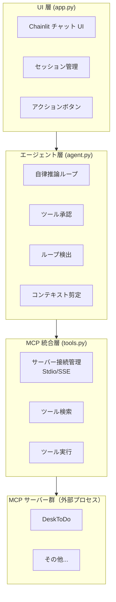
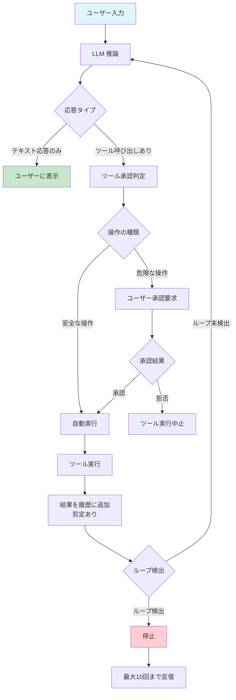

# DeskMCP

ローカル環境で動作する AI 秘書システム。Chainlit ベースのチャット UI と MCP（Model Context Protocol）を組み合わせ、自律的なエージェントがツールを駆使してタスクを遂行します。プライベートな環境で動作し、外部クラウドへのデータ送信なしにタスク管理・検索・文書解析などを利用できます。

## 特徴・機能

- **自律型エージェントループ** — ユーザーの指示を受けると、LLM が推論→ツール実行判定→ツール実行→履歴更新→再推論を最大10回まで自動反復し、タスクを完遂します
- **MCP プロトコル統合** — Stdio / SSE 両トランスポートに対応し、複数の MCP サーバーからツールを動的に取得・実行します
- **OpenAI 互換 API 対応** — Ollama / vLLM / LM Studio など、OpenAI 互換の推論エンドポイントを利用可能（デフォルト: Ollama `localhost:11434`）
- **小規模LLM対応** — ツールフィルタリング・説明圧縮・強化版システムプロンプトにより、7B〜9B程度の小規模モデルでもツールを適切に認識・使い分け可能
- **ツール実行承認システム** — `create_` / `update_` / `delete_` 等の危険操作はユーザーの承認が必要。`get_` / `list_` / `check_` 等の安全な操作は自動実行されます
- **コンテキスト剪定（Pruning）** — ツールの大量出力を要約し、コンテキスト上限（コンフィグで設定可能、デフォルト: ハードリミット8192トークン / ソフトリミット6000トークン）に収めます
- **ループ検出** — 3段階（完全一致・ツール名一致・総呼び出し回数）で無限ループを検出し、エージェントの暴走を防ぎます
- **アクションボタン / マクロ** — 設定ファイルで定義したボタンをチャット UI に表示し、ワンクリックで所定のプロンプトとペルソナを注入できます
- **チャット履歴の永続化** — SQLite（WALモード）によりスレッド・ステップ単位で会話履歴を保存し、セッション再開が可能です
- **DeskToDo MCP サーバー同梱** — タスク管理に特化した MCP サーバーを標準搭載。FTS5 全文検索・エンベディング意味検索・一括操作・変更履歴追跡など34以上のツールを提供します

## アーキテクチャ / 構成

3層アーキテクチャで構成されています。



### 各層の役割

| 層 | ファイル | 役割 |
|---|---|---|
| UI 層 | [`app.py`](app.py) | Chainlit のライフサイクルイベント処理、セッション初期化・再開、アクションボタン描画、チャット設定（マクロ選択・トグル）、メッセージ送受信 |
| エージェント層 | [`agent.py`](agent.py) | LLM 推論呼び出し（httpx 経由）、ツール実行判定・実行、承認要求、ループ検出、メッセージ履歴の剪定 |
| MCP 統合層 | [`tools.py`](tools.py) | MCP サーバー設定の読み込み、Stdio/SSE 接続の確立・切断、ツール一覧取得（OpenAI function calling 形式）、ツール呼び出しのルーティング |
| データ層 | [`data_layer.py`](data_layer.py) | Chainlit の `BaseDataLayer` 実装。SQLite によるスレッド・ステップの CRUD、WAL モード有効化、不要メッセージの保存除外 |

## 必要要件

- **Python**: 3.10 以上
- **Ollama**（または OpenAI 互換 API サーバー）: 推論エンドポイントとして使用
  - デフォルト接続先: `http://localhost:11434/v1`
- **Ollama モデル**: 事前にモデルの pull が必要（例: `ollama pull qwen3.5:9b`）
- **OS**: Windows / macOS / Linux

## インストール手順

### 1. リポジトリのクローン

```bash
git clone <repository-url>
cd DeskMCP
```

### 2. Python 依存パッケージのインストール

```bash
pip install -r requirements.txt
```

主要な依存パッケージ:

| パッケージ | バージョン | 用途 |
|---|---|---|
| `chainlit` | >=1.0.0 | チャット UI フレームワーク |
| `httpx` | >=0.25.0 | LLM API 非同期 HTTP クライアント |
| `mcp` | >=1.0.0 | MCP プロトコルクライアント |
| `anyio` | >=3.7.0 | 非同期ユーティリティ |
| `aiosqlite` | >=0.19.0 | SQLite 非同期アクセス |
| `typing-extensions` | >=4.8.0 | 型拡張 |
| `python-dotenv` | >=1.0.0 | 環境変数ローダー |

### 3. DeskToDo MCP サーバーの依存インストール

```bash
pip install -r default_mcp_server/DeskToDo/requirements.txt
```

### 4. Ollama のセットアップ

```bash
# Ollama をインストール・起動後、モデルを pull
ollama pull qwen3.5:9b
```

### 5. 設定ファイルの配置

`resources/default_configs/` にあるデフォルト設定を `config/` ディレクトリにコピーします（`config/` は `.gitignore` によりバージョン管理対象外）。

```bash
mkdir config
copy resources\default_configs\* config\
```

### 6. 環境変数の設定（認証用シークレット）— `chainlit run` で起動する場合のみ必要

> **重要:** この設定は `chainlit run app.py` で起動する場合のみ必要です。`python app.py` で起動する場合は自動生成されるため設定不要です。

Chainlit 2.x で認証機能（チャット履歴の保存など）を使用するには、JWT シークレットの設定が必要です。`chainlit run` コマンドで起動する場合は、事前にシークレットの設定が必須です。

**手順:**

1. `.env` ファイルをプロジェクトルートに作成します（まだ存在しない場合）

2. 以下のコマンドを実行してシークレットを生成し、`.env` に追加します：

```bash
chainlit create-secret
```

出力例：
```
Copy the following secret into your .env file. Once it is set, changing it will logout all users with active sessions.
CHAINLIT_AUTH_SECRET="xxxxxxxxxxxxxxxxxxxxxxxxxxxxxxxxxxxxxxxxxxxxxxxxxxxxxxxxxxxxxxxx"
```

3. 表示された `CHAINLIT_AUTH_SECRET=...` の行を `.env` ファイルに貼り付けます

**注意:**
- シークレットは一度設定すると、変更すると全てのユーザーセッションが無効になります
- `.env` ファイルは `.gitignore` に含まれているため、Git にコミットされません

## 設定方法

設定ファイルは `config/` ディレクトリに配置します。存在しない場合は `resources/default_configs/` のデフォルト設定が使用されます。

### system_config.json — システム全体の設定

```json
{
  "llm_settings": {
    "provider": "ollama",
    "base_url": "http://localhost:11434/v1",
    "model_name": "qwen3.5:9b",
    "api_key": ""
  },
  "context_management": {
    "hard_limit_tokens": 8192,
    "soft_limit_tokens": 6000,
    "tool_definition_budget_tokens": 4000,
    "message_history_budget_tokens": 2000
  },
  "tool_filter_settings": {
    "enabled": true,
    "max_tools": 15,
    "always_include": ["get_server_info"],
    "compression_mode": "compact"
  },
  "system_prompt_settings": {
    "use_enhanced_prompt": true,
    "include_tool_guidelines": true
  },
  "agent_safeguards": {
    "max_repeated_loops": 3,
    "inference_timeout_seconds": 180,
    "tool_execution_timeout_seconds": 60
  },
  "mode_settings": {
    "default_mode": "code",
    "custom_modes": []
  },
  "network_settings": {
    "proxy_bypass_hosts": ["localhost", "127.0.0.1", "::1", "*.local"]
  },
  "system_prompt": "あなたは親切で有能なAIアシスタントです。..."
}
```

| 項目 | 説明 |
|---|---|
| `llm_settings.provider` | LLM プロバイダー（`ollama` 等） |
| `llm_settings.base_url` | OpenAI 互換 API のベース URL |
| `llm_settings.model_name` | 使用するモデル名 |
| `context_management.hard_limit_tokens` | コンテキストのハードリミット（トークン数） |
| `context_management.soft_limit_tokens` | 剪定を開始するソフトリミット（トークン数） |
| `context_management.tool_definition_budget_tokens` | ツール定義用のトークン予算（小規模LLM向け） |
| `context_management.message_history_budget_tokens` | メッセージ履歴用のトークン予算（小規模LLM向け） |
| `tool_filter_settings.enabled` | ツールフィルタリングの有効化 |
| `tool_filter_settings.max_tools` | 最大ツール数（小規模LLMは10〜20推奨） |
| `tool_filter_settings.always_include` | 常に含めるツール名のリスト |
| `tool_filter_settings.compression_mode` | ツール説明の圧縮モード（`compact` / `minimal` / `full`） |
| `system_prompt_settings.use_enhanced_prompt` | 強化版システムプロンプトの使用 |
| `system_prompt_settings.include_tool_guidelines` | ツール使用ガイドラインの含めるか |
| `agent_safeguards.max_repeated_loops` | 同一ツールの連続呼び出し上限 |
| `agent_safeguards.inference_timeout_seconds` | 推論のタイムアウト（秒） |
| `agent_safeguards.tool_execution_timeout_seconds` | ツール実行のタイムアウト（秒） |
| `mode_settings.default_mode` | デフォルトの動作モード |
| `mode_settings.custom_modes` | カスタムモード定義（配列） |
| `network_settings.proxy_bypass_hosts` | プロキシバイパス対象ホストのリスト（配列） |
| `system_prompt` | エージェントのシステムプロンプト |

#### 小規模LLM向け設定

7B〜9B程度の小規模モデルを使用する場合、以下の設定を推奨します：

```json
{
  "llm_settings": {
    "model_name": "qwen3.5:7b"
  },
  "context_management": {
    "hard_limit_tokens": 4096,
    "soft_limit_tokens": 3000,
    "tool_definition_budget_tokens": 2000,
    "message_history_budget_tokens": 1000
  },
  "tool_filter_settings": {
    "enabled": true,
    "max_tools": 10,
    "compression_mode": "compact"
  },
  "system_prompt_settings": {
    "use_enhanced_prompt": true,
    "include_tool_guidelines": true
  }
}
```

**小規模LLM向け設定のポイント：**

- `max_tools` を10〜15程度に制限し、ツール選択の負担を軽減
- `compression_mode` を `compact` に設定し、ツール説明を簡潔化
- `use_enhanced_prompt` を `true` に設定し、ツール使い分けのガイドラインを追加
- コンテキスト制限を低めに設定し、オーバーフローを防止

### ツールフィルタリングの仕組み

小規模LLM（7B〜9B程度）でも適切にツールを選択できるよう、多段階のフィルタリング機能を提供しています。

#### フィルタリングの流れ

1. **カテゴリマッチング**: ユーザー入力からキーワードを抽出し、定義済みカテゴリ（タスク管理、検索、一括操作など）を特定
2. **パターンマッチング**: カテゴリに対応するツール名パターン（`list_*`、`get_*`など）でツールを抽出
3. **キーワードマッチング**: ユーザー入力に含まれる単語とツール名・説明を照合
4. **動的カテゴリマッチング**: ツールの説明から自動的にキーワードを抽出し、関連ツールを検出。新しいMCPサーバー追加時も自動対応
5. **always_include追加**: `system_config.json`の`always_include`で指定したツールを常に追加
6. **結合・制限**: 全ステップの結果を結合し、重複排除後、`max_tools`件数に制限

#### サーバー指定フィルタリング

ボタン設定の`mcp_server`フィールド、またはAPI呼び出し時に`server_name`パラメータを指定すると、**指定したMCPサーバーのツールのみ**がフィルタリング対象になります。

この機能により、タスク管理ボタン押下時にRAG関連ツールが候補に含まれることを防ぎ、ツール選択の精度を向上させます。

### mcp_servers.json — MCP サーバー接続設定

```json
{
  "mcpServers": {
    "DeskToDo": {
      "command": "python",
      "args": ["desktodo_mcp.py"],
      "cwd": "default_mcp_server/DeskToDo",
      "env": {
        "DESKTODO_DATA_DIR": "./mydata"
      }
    }
  }
}
```

Stdio トランスポートの場合は `command` / `args` / `cwd` / `env` を指定し、SSE トランスポートの場合は `url` を指定します。`tools.py` の [`MCPServerConfig`](tools.py:39) が `command` の有無でトランスポート種別を自動判定します。

### buttons_config.json — アクションボタン設定

チャット UI に表示するボタンを定義します。各ボタンには以下の項目を設定します。

| 項目 | 説明 |
|---|---|
| `id` | ボタンの一意識別子 |
| `ui_label` | UI に表示するラベル |
| `ui_description` | ボタンの説明文 |
| `agent_persona` | ボタン押下時に適用するエージェントのペルソナ |
| `task_instruction` | ボタン押下時に注入するタスク指示 |
| `mcp_server` | 関連付ける MCP サーバー名 |

#### `mcp_server` フィールドの動作

`mcp_server` フィールドを設定すると、ボタン押下時に**指定したMCPサーバーのツールのみ**がLLMに渡されます。これにより、特定のタスクに特化したツールセットを使用でき、小規模LLMでのツール選択精度が向上します。

| 設定値 | 動作 |
|---|---|
| `"DeskToDo"` | DeskToDoサーバーのツールのみ使用 |
| `"local-rag"` | local-ragサーバーのツールのみ使用 |
| 未設定（`null`または省略） | 全MCPサーバーのツールを使用 |

**使用例：**

```json
{
  "id": "list_tasks",
  "ui_label": "📋 タスク一覧",
  "task_instruction": "list_pending_tasksツールを使用して...",
  "mcp_server": "DeskToDo"
}
```

この設定により、タスク一覧ボタン押下時はDeskToDoのツールのみがLLMに提供され、ツール選択の負担が軽減されます。

デフォルトでは以下の6つのボタンが定義されています。

- **タスク一覧表示** (`list_tasks`) — 未完了タスクの一覧を表示
- **タスク状況確認** (`check_tasks`) — タスクの統計・期限切れを確認
- **タスク整理** (`organize_tasks`) — タスクの整理・分類を提案
- **タスク分解** (`breakdown_tasks`) — タスクをサブタスクに分解
- **インデックス更新** (`update_rag_index`) — ローカルRAGのドキュメントインデックスを更新
- **インデックス状況確認** (`check_rag_index_status`) — ドキュメントインデックスの状況を確認

### プロキシ環境での利用

プロキシが必要なネットワーク環境でローカルネットワーク上の Ollama や MCP サーバー（SSE 接続）を使用する場合、アプリケーション起動時に自動的に `NO_PROXY` 環境変数が設定され、ローカル通信がプロキシをバイパスするようになります。

**自動設定の仕組み:**

- `system_config.json` の `network_settings.proxy_bypass_hosts` に定義されたホストが `NO_PROXY` 環境変数に設定されます
- `llm_settings.base_url` のホスト名（Ollama 接続先）が自動的にバイパスリストに追加されます
- `mcp_servers.json` の SSE 接続先 URL のホスト名も自動的にバイパスリストに追加されます

**デフォルトのバイパス対象ホスト:**

- `localhost`
- `127.0.0.1`
- `::1`
- `*.local`

**カスタマイズ方法:**

`config/system_config.json` で `network_settings.proxy_bypass_hosts` を編集することで、バイパス対象のホストを変更できます：

```json
{
  "network_settings": {
    "proxy_bypass_hosts": ["localhost", "127.0.0.1", "::1", "*.local", "192.168.1.*"]
  }
}
```

**手動での回避策:**

アプリケーション起動前に環境変数を設定することでも回避可能です：

```bash
# Windows
set NO_PROXY=localhost,127.0.0.1,::1
set no_proxy=localhost,127.0.0.1,::1

# Linux/macOS
export NO_PROXY=localhost,127.0.0.1,::1
export no_proxy=localhost,127.0.0.1,::1
```

## 使い方 / 起動方法

### アプリケーションの起動

このアプリケーションは2つの方法で起動できます。それぞれ初期設定の要件が異なります。

#### 方法1: `python app.py` で起動する場合

```bash
python app.py
```

- **初期設定不要** — `CHAINLIT_AUTH_SECRET` が未設定の場合、初回起動時に自動生成されます
- 初回起動時に `.env` ファイルが存在しない場合は自動作成され、シークレットが書き込まれます
- デフォルトポートは **2000** です（`CHAINLIT_PORT` 環境変数で変更可能）
- 手軽に始めたい場合に推奨

#### 方法2: `chainlit run app.py` で起動する場合

```bash
chainlit run app.py
```

- **事前設定が必要** — `.env` ファイルに `CHAINLIT_AUTH_SECRET` を設定する必要があります
- 設定手順：
  1. 以下のコマンドを実行してシークレットを生成
     ```bash
     chainlit create-secret
     ```
  2. 表示されたシークレットを `.env` ファイルに追加
     ```
     CHAINLIT_AUTH_SECRET=<生成されたシークレット>
     ```
- Chainlit の標準的な起動方法

> **注意:** どちらの方法でも、ブラウザが自動的に開き、チャット UI が表示されます（デフォルト: `http://localhost:2000`）。

### 基本的な使い方

1. **チャットで対話** — テキストボックスにメッセージを入力して送信すると、エージェントが自律的にツールを選択・実行して応答します
2. **アクションボタンを利用** — チャット左側のアクションボタンをクリックすると、事前定義されたプロンプトが注入され、特定のタスクを即座に実行できます
3. **ツール実行の承認** — 危険な操作（タスクの作成・更新・削除など）には承認ダイアログが表示されます。「承認」または「拒否」を選択してください
4. **セッションの再開** — ブラウザを閉じても、再アクセス時に過去のスレッド一覧から会話を再開できます（SQLite に履歴が保存されています）
5. **チャット設定** — UI の設定パネルからマクロの選択や各種トグルの切り替えが可能です

### エージェントの動作フロー



## ディレクトリ構成

```
DeskMCP/
├── app.py                          # Chainlit UI エントリポイント
├── agent.py                        # 自律エージェントロジック
├── tools.py                        # MCP クライアント統合層
├── data_layer.py                   # SQLite データ層（チャット履歴）
├── chainlit.md                     # Chainlit ウェルカムメッセージ
├── requirements.txt                # Python 依存パッケージ
├── .gitignore                      # Git 除外設定
├── data/                           # チャット履歴 DB（chat_history.db）
├── config/                         # ユーザー設定（gitignore 対象）
│   ├── system_config.json
│   ├── mcp_servers.json
│   └── buttons_config.json
├── resources/
│   └── default_configs/            # デフォルト設定ファイル
│       ├── system_config.json      #   システム設定
│       ├── mcp_servers.json        #   MCP サーバー設定
│       └── buttons_config.json     #   アクションボタン設定
└── default_mcp_server/
    └── DeskToDo/                   # DeskToDo MCP サーバー
        ├── desktodo_mcp.py         #   MCP サーバー実装
        ├── desktodo_config.yaml.example  #   設定ファイル例
        ├── requirements.txt        #   サーバー依存パッケージ
        ├── README.md               #   サーバー個別 README
        ├── secretary_mcp_spec.md   #   仕様書
        └── mydata/                 #   タスクデータ保存先
```

## MCP サーバー（DeskToDo）について

DeskToDo は本プロジェクトに同梱されるタスク管理特化型 MCP サーバーです。Python の FastMCP フレームワークで実装され、SQLite（WALモード）をデータストアとして使用します。

### 主な機能

- **タスク CRUD** — タスクの追加・取得・更新・削除・完了・アーカイブ・復元
- **高度な検索** — キーワード検索・FTS5 全文検索・エンベディング意味検索・断片検索・複合条件検索
- **一括操作** — 複数タスクの一括登録・一括ステータス変更・一括期日変更・一括削除
- **統計・分析** — タスク統計情報・期限切れタスク抽出・期間指定取得・最近の更新取得
- **変更履歴** — タスクごとの変更履歴を全て記録・参照可能
- **文書ファイル読み込み** — `.eml` / `.msg` / `.txt` / `.md` / `.csv` ファイルをパースしてテキスト抽出
- **データベースバックアップ** — SQLite DB のバックアップ作成

### 提供ツール一覧（34ツール）

| カテゴリ | ツール名 | 説明 |
|---|---|---|
| **タスク操作** | `add_task` | タスクの新規登録 |
| | `list_pending_tasks` | 未完了タスク一覧の取得 |
| | `list_all_tasks` | 全タスク一覧の取得 |
| | `update_task_date` | 期日の変更 |
| | `update_task_title` | タイトルの変更 |
| | `update_task_description` | 説明の変更 |
| | `update_task_priority` | 優先度の変更 |
| | `update_task_category` | カテゴリの変更 |
| | `update_task_status` | ステータスの変更 |
| | `complete_task` | タスクの完了 |
| | `archive_task` | タスクのアーカイブ |
| | `restore_task` | アーカイブ済みタスクの復元 |
| | `delete_task` | タスクの物理削除 |
| | `get_task_history` | 変更履歴の取得 |
| **検索** | `search_tasks` | キーワード検索 |
| | `fuzzy_search_tasks` | FTS5 あいまい検索 |
| | `semantic_search_tasks` | エンベディング意味検索 |
| | `search_tasks_advanced` | 複合条件検索 |
| | `search_tasks_by_content_fragments` | 断片キーワード検索 |
| | `get_all_unique_words` | ユニーク単語一覧取得 |
| **一覧・統計** | `get_overdue_tasks` | 期限切れタスクの取得 |
| | `get_tasks_by_date_range` | 期間指定タスク取得 |
| | `get_task_statistics` | 統計情報の取得 |
| | `get_recent_tasks` | 最近登録されたタスク取得 |
| | `get_completed_tasks` | 完了済みタスク取得 |
| | `get_recently_modified_tasks` | 最近更新されたタスク取得 |
| **一括操作** | `add_tasks_bulk` | 複数タスクの一括登録 |
| | `update_tasks_status_bulk` | 複数タスクのステータス一括変更 |
| | `update_tasks_due_date_bulk` | 複数タスクの期日一括変更 |
| | `delete_tasks_bulk` | 複数タスクの一括削除 |
| **その他** | `read_document_file` | 文書ファイルの読み込み |
| | `backup_database` | データベースバックアップ |
| | `get_server_info` | サーバー情報の取得 |
| | `rebuild_embeddings` | エンベディングの再構築 |

### エンベディング検索

DeskToDo は Ollama API を使用したエンベディングベースの意味検索をサポートします。デフォルトのエンベディングモデルは `qwen3-embedding:0.6b` です。`semantic_search_tasks` ツールで `use_embedding=True` を指定すると、キーワード一致ではなく意味的類似性に基づく検索が実行されます。

### 設定

DeskToDo の設定は `desktodo_config.yaml` で行います。設定ファイルが存在しない場合はデフォルト値が使用されます。設定例は [`desktodo_config.yaml.example`](default_mcp_server/DeskToDo/desktodo_config.yaml.example) を参照してください。

詳細な仕様・実装については [`default_mcp_server/DeskToDo/README.md`](default_mcp_server/DeskToDo/README.md) を参照してください。

### MCPサーバーの追加

新しいMCPサーバーを追加する手順は以下の通りです。

#### 手順

1. **`mcp_servers.json`に設定を追加**

```json
{
  "mcpServers": {
    "DeskToDo": { ... },
    "NewServer": {
      "command": "python",
      "args": ["new_server.py"],
      "cwd": "path/to/server"
    }
  }
}
```

2. **ボタン設定で`mcp_server`を指定（オプション）**

新しいサーバー専用のボタンを作成する場合、`buttons_config.json`で`mcp_server`フィールドを設定します：

```json
{
  "id": "new_server_action",
  "ui_label": "🆕 新機能",
  "task_instruction": "NewServerのツールを使用して...",
  "mcp_server": "NewServer"
}
```

3. **ツールフィルタリング設定の調整（必要に応じて）**

新しいサーバーのツールが多数ある場合、`system_config.json`の`max_tools`を調整してください。

#### 注意点

- **動的カテゴリマッチング**: 新しいサーバーのツール説明から自動的にキーワードが抽出されるため、カテゴリ定義を追加する必要はありません
- **サーバー名の一致**: `mcp_servers.json`のキー名と`buttons_config.json`の`mcp_server`値が一致していることを確認してください
- **接続確認**: アプリケーション起動時にサーバー接続がログに出力されます。接続エラーがある場合は設定を確認してください

## ライセンス

このプロジェクトは [MIT License](LICENSE) の下で公開されています。