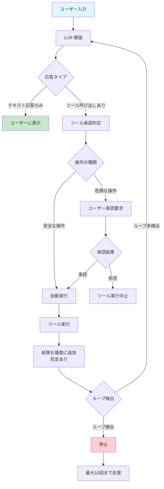
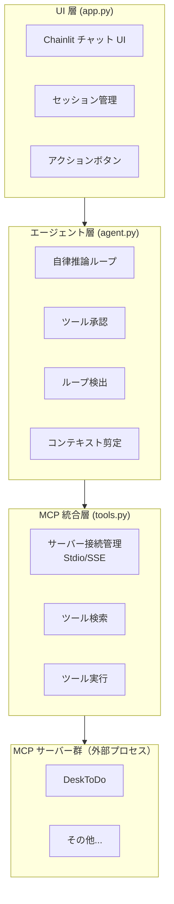

# DeskMCP

ローカル環境で動作する AI 秘書システム。Chainlit ベースのチャット UI と MCP（Model Context Protocol）を組み合わせ、自律的なエージェントがツールを駆使してタスクを遂行します。プライベートな環境で動作し、外部クラウドへのデータ送信なしにタスク管理・検索・文書解析などを利用できます。

## 🚀 クイックスタート

5分でDeskMCPを始める最小限の手順です。

```bash
# 1. リポジトリをクローン
git clone <repository-url>
cd DeskMCP

# 2. 依存パッケージをインストール
pip install -r requirements.txt
pip install -r default_mcp_server/DeskToDo/requirements.txt

# 3. 設定ファイルを配置
mkdir config
copy resources\default_configs\* config\

# 4. Ollamaでモデルを用意（例: qwen3.5:9b）
ollama pull qwen3.5:9b

# 5. 起動
python app.py
```

> ⚠️ **重要:** デフォルトで `http://localhost:2000` でブラウザが開きます。Ollama が `localhost:11434` で動作していることを確認してください。

## ✨ 特徴・機能

自律型エージェントによるタスク実行と、プライベート環境での安全なデータ管理を提供します。

- **自律型エージェントループ** — ユーザーの指示を受けると、LLM が推論→ツール実行判定→ツール実行→履歴更新→再推論を最大10回まで自動反復し、タスクを完遂します
- **MCP プロトコル統合** — Stdio / SSE 両トランスポートに対応し、複数の MCP サーバーからツールを動的に取得・実行します
- **OpenAI 互換 API 対応** — Ollama / vLLM / LM Studio など、OpenAI 互換の推論エンドポイントを利用可能（デフォルト: Ollama `localhost:11434`）
- **小規模LLM対応** — ツールフィルタリング・説明圧縮・強化版システムプロンプトにより、7B〜9B程度の小規模モデルでもツールを適切に認識・使い分け可能（詳細は「⚙️ 設定方法」を参照）
- **ツール実行承認システム** — `create_` / `update_` / `delete_` 等の危険操作はユーザーの承認が必要。`get_` / `list_` / `check_` 等の安全な操作は自動実行されます
- **コンテキスト剪定（Pruning）** — ツールの大量出力を要約し、コンテキスト上限に収めます（デフォルト: ハードリミット8192トークン / ソフトリミット6000トークン）
- **ループ検出** — 3段階（完全一致・ツール名一致・総呼び出し回数）で無限ループを検出し、エージェントの暴走を防ぎます
- **アクションボタン / マクロ** — 設定ファイルで定義したボタンをチャット UI に表示し、ワンクリックで所定のプロンプトとペルソナを注入できます
- **チャット履歴の永続化** — SQLite（WALモード）によりスレッド・ステップ単位で会話履歴を保存し、セッション再開が可能です
- **DeskToDo MCP サーバー同梱** — タスク管理に特化した MCP サーバーを標準搭載。FTS5 全文検索・エンベディング意味検索・一括操作・変更履歴追跡など34以上のツールを提供します

## 📋 必要要件

DeskMCPを動作させるために必要な環境です。

- **Python**: 3.10 以上
- **Ollama**（または OpenAI 互換 API サーバー）: 推論エンドポイントとして使用
  - デフォルト接続先: `http://localhost:11434/v1`
- **Ollama モデル**: 事前にモデルの pull が必要（例: `ollama pull qwen3.5:9b`）
- **OS**: Windows / macOS / Linux

## 📥 インストール手順

詳細なセットアップ手順です。クイックスタートで問題ない場合は読み飛ばしてください。

### リポジトリのクローン

```bash
git clone <repository-url>
cd DeskMCP
```

### Python 依存パッケージのインストール

```bash
pip install -r requirements.txt
```

主要な依存パッケージ:

| パッケージ | バージョン | 用途 |
|---|---|---|
| `chainlit` | >=1.0.0 | チャット UI フレームワーク |
| `httpx` | >=0.25.0 | LLM API 非同期 HTTP クライアント |
| `mcp` | >=1.0.0 | MCP プロトコルクライアント |
| `anyio` | >=3.7.0 | 非同期ユーティリティ |
| `aiosqlite` | >=0.19.0 | SQLite 非同期アクセス |

### DeskToDo MCP サーバーの依存インストール

```bash
pip install -r default_mcp_server/DeskToDo/requirements.txt
```

### Ollama のセットアップ

```bash
# Ollama をインストール・起動後、モデルを pull
ollama pull qwen3.5:9b
```

### 設定ファイルの配置

`resources/default_configs/` にあるデフォルト設定を `config/` ディレクトリにコピーします。

```bash
mkdir config
copy resources\default_configs\* config\
```

> ⚠️ **重要:** `config/` ディレクトリは `.gitignore` によりバージョン管理対象外です。カスタマイズした設定はここに配置してください。

## 🎮 使い方 / 起動方法

アプリケーションの起動方法と基本的な使い方です。

### アプリケーションの起動

このアプリケーションは2つの方法で起動できます。

**方法1: `python app.py` で起動する場合（推奨）**

```bash
python app.py
```

- **初期設定不要** — `CHAINLIT_AUTH_SECRET` が未設定の場合、初回起動時に自動生成されます
- デフォルトポートは **2000** です（`CHAINLIT_PORT` 環境変数で変更可能）

**方法2: `chainlit run app.py` で起動する場合**

```bash
chainlit run app.py
```

- **事前設定が必要** — `.env` ファイルに `CHAINLIT_AUTH_SECRET` を設定する必要があります

> ⚠️ **重要:** `chainlit run` で起動する場合は、事前に `chainlit create-secret` コマンドを実行してシークレットを生成し、`.env` ファイルに追加してください。

### 環境変数の設定

| 環境変数 | 説明 | デフォルト値 |
|---|---|---|
| `CHAINLIT_AUTH_SECRET` | Chainlit 認証用シークレット（`chainlit run` 使用時のみ必須） | 自動生成（`python app.py` の場合） |
| `CHAINLIT_PORT` | チャット UI のポート番号 | `2000` |

### 基本的な使い方

1. **チャットで対話** — テキストボックスにメッセージを入力して送信すると、エージェントが自律的にツールを選択・実行して応答します
2. **アクションボタンを利用** — チャット左側のアクションボタンをクリックすると、事前定義されたプロンプトが注入され、特定のタスクを即座に実行できます
3. **ツール実行の承認** — 危険な操作（タスクの作成・更新・削除など）には承認ダイアログが表示されます。「承認」または「拒否」を選択してください
4. **セッションの再開** — ブラウザを閉じても、再アクセス時に過去のスレッド一覧から会話を再開できます

### エージェントの動作フロー



## 🏗️ アーキテクチャ / 構成

3層アーキテクチャで構成されています。



### 各層の役割

| 層 | ファイル | 役割 |
|---|---|---|
| UI 層 | [`app.py`](app.py) | Chainlit のライフサイクルイベント処理、セッション初期化・再開、アクションボタン描画 |
| エージェント層 | [`agent.py`](agent.py) | LLM 推論呼び出し、ツール実行判定・実行、承認要求、ループ検出、メッセージ履歴の剪定 |
| MCP 統合層 | [`tools.py`](tools.py) | MCP サーバー設定の読み込み、Stdio/SSE 接続の確立・切断、ツール一覧取得・呼び出しルーティング |
| データ層 | [`data_layer.py`](data_layer.py) | Chainlit の `BaseDataLayer` 実装。SQLite によるスレッド・ステップの CRUD |

## ⚙️ 設定方法

システムの詳細設定方法です。デフォルト設定のままで問題ない場合は読み飛ばしてください。

### 設定ファイルの構成

本システムは2つの設定ディレクトリを使用します。

| ディレクトリ | 役割 | 優先度 |
|---|---|---|
| `resources/default_configs/` | デフォルト設定（Git管理対象） | 低 |
| `config/` | ユーザーカスタマイズ設定（Git管理対象外） | 高 |

> ⚠️ **重要:** `config/` ディレクトリに設定ファイルが存在する場合、その設定が優先されます。カスタマイズしたい設定のみを `config/` に配置してください。

### 設定ファイル一覧

| ファイル | 説明 |
|---|---|
| `system_config.json` | システム全体の設定（LLM、コンテキスト、ツールフィルタ等） |
| `mcp_servers.json` | MCPサーバー接続設定 |
| `buttons_config.json` | アクションボタン設定 |
| `scoring_rules.json` | ツールフィルタリング用スコアリングルール |

### system_config.json — システム全体の設定

LLM、コンテキスト管理、ツールフィルタリングなどのシステム設定を定義します。

```json
{
  "llm_settings": {
    "provider": "ollama",
    "base_url": "http://localhost:11434/v1",
    "model_name": "qwen3.5:9b",
    "api_key": "optional_key_here"
  },
  "context_management": {
    "hard_limit_tokens": 8192,
    "soft_limit_tokens": 6000,
    "tool_definition_budget_tokens": 4000,
    "message_history_budget_tokens": 2000
  },
  "agent_safeguards": {
    "max_repeated_loops": 3,
    "inference_timeout_seconds": 180,
    "tool_execution_timeout_seconds": 60
  },
  "tool_filter_settings": {
    "enabled": true,
    "max_tools": 15,
    "always_include": ["get_server_info"],
    "compression_mode": "compact"
  },
  "system_prompt_settings": {
    "use_enhanced_prompt": true,
    "include_tool_guidelines": true
  },
  "mode_settings": {
    "default_mode": "code",
    "custom_modes": []
  },
  "network_settings": {
    "proxy_bypass_hosts": ["localhost", "127.0.0.1", "::1", "*.local"]
  },
  "system_prompt": "あなたは親切で有能なAIアシスタントです。ユーザーの質問に丁寧かつ正確に回答してください。"
}
```

**主要な設定項目:**

| 項目 | 説明 |
|---|---|
| `llm_settings.base_url` | OpenAI 互換 API のベース URL |
| `llm_settings.model_name` | 使用するモデル名 |
| `context_management.hard_limit_tokens` | コンテキストのハードリミット（トークン数） |
| `tool_filter_settings.max_tools` | 最大ツール数（小規模LLMは10〜20推奨） |
| `tool_filter_settings.compression_mode` | ツール説明の圧縮モード（`compact` / `minimal` / `full`） |

### 小規模LLM向け設定

7B〜9B程度の小規模モデルを使用する場合の推奨設定です。

```json
{
  "llm_settings": { "model_name": "qwen3.5:4b" },
  "context_management": {
    "hard_limit_tokens": 4096,
    "soft_limit_tokens": 3000
  },
  "tool_filter_settings": {
    "enabled": true,
    "max_tools": 10,
    "compression_mode": "compact"
  },
  "system_prompt_settings": {
    "use_enhanced_prompt": true
  }
}
```

**ポイント:**
- `max_tools` を10〜15程度に制限し、ツール選択の負担を軽減
- `compression_mode` を `compact` に設定し、ツール説明を簡潔化
- `use_enhanced_prompt` を `true` に設定し、ツール使い分けのガイドラインを追加

### ツールフィルタリングの仕組み

小規模LLMでも適切にツールを選択できるよう、多段階のフィルタリング機能を提供しています。

1. **カテゴリマッチング**: ユーザー入力からキーワードを抽出し、定義済みカテゴリを特定
2. **パターンマッチング**: カテゴリに対応するツール名パターンでツールを抽出
3. **キーワードマッチング**: ユーザー入力に含まれる単語とツール名・説明を照合
4. **動的カテゴリマッチング**: ツールの説明から自動的にキーワードを抽出し、関連ツールを検出
5. **always_include追加**: `system_config.json`の`always_include`で指定したツールを常に追加
6. **結合・制限**: 全ステップの結果を結合し、重複排除後、`max_tools`件数に制限

### scoring_rules.json — スコアリングルール設定

ツールフィルタリングの精度を向上させるためのスコアリングルールを定義します。

```json
{
  "scoring_rules": [
    {
      "name": "communication_check",
      "keywords": ["通信確認", "接続確認", "通信テスト", "接続テスト", "通信", "接続", "確認して", "確認", "テスト"],
      "tool_patterns": ["get*", "list*", "status*", "check*"],
      "weight": 2.5
    },
    {
      "name": "create_action",
      "keywords": ["作成", "追加", "新規", "登録", "作って", "追加して"],
      "tool_patterns": ["create*", "add*", "new*", "insert*"],
      "weight": 2.0
    },
    {
      "name": "update_action",
      "keywords": ["更新", "変更", "修正", "編集", "変えて", "修正して"],
      "tool_patterns": ["update*", "edit*", "modify*", "change*"],
      "weight": 2.0
    },
    {
      "name": "delete_action",
      "keywords": ["削除", "消去", "削除して", "消して", "削る"],
      "tool_patterns": ["delete*", "remove*", "destroy*"],
      "weight": 2.0
    },
    {
      "name": "search_action",
      "keywords": ["検索", "探して", "探す", "検索して", "見つけて"],
      "tool_patterns": ["search*", "find*", "get*", "list*"],
      "weight": 1.5
    }
  ]
}
```

**デフォルトのスコアリングルール:**

| ルール名 | キーワード例 | ツールパターン | 重み |
|---|---|---|---|
| `create_action` | 作成、追加、新規 | `create*`, `add*` | 2.0 |
| `update_action` | 更新、変更、修正 | `update*`, `edit*` | 2.0 |
| `delete_action` | 削除、消去 | `delete*`, `remove*` | 2.0 |
| `search_action` | 検索、探して | `search*`, `find*` | 1.5 |

### mcp_servers.json — MCP サーバー接続設定

MCPサーバーの接続設定を定義します。Stdio トランスポートの場合は `command` / `args` / `cwd` / `env` を指定し、SSE トランスポートの場合は `url` を指定します。

```json
{
  "mcpServers": {
    "DeskToDo": {
      "command": "python",
      "args": ["desktodo_mcp.py"],
      "cwd": "default_mcp_server/DeskToDo",
      "env": { "DESKTODO_DATA_DIR": "./mydata" }
    }
  }
}
```

**keywords フィールド（サーバー推定用）:**

各MCPサーバーに `keywords` フィールドを設定することで、ツールフィルタリング時のサーバー推定精度を向上させることができます。

**フィールドの説明:**
- `include`: このサーバーが適切と推定されるキーワードのリスト（ユーザー入力に含まれるとサーバースコアが上がる）
- `exclude`: このサーバーが不適切と推定されるキーワードのリスト（ユーザー入力に含まれるとサーバースコアが下がる）
- `weight`: サーバー推定時の重み付け（デフォルト1.0、省略可能）。大きい値ほど優先度が高くなる

**設定例（複数サーバー構成）:**

```json
{
  "mcpServers": {
    "DeskToDo": {
      "keywords": {
        "include": ["タスク", "やること", "ToDo", "todo", "タスク管理"],
        "exclude": ["redmine", "issue", "チケット"],
        "weight": 1.0
      }
    },
    "local-rag": {
      "keywords": {
        "include": ["検索", "RAG", "ドキュメント", "文書", "ローカル"],
        "exclude": ["web", "インターネット", "オンライン"],
        "weight": 0.8
      }
    },
    "Redmine": {
      "keywords": {
        "include": ["redmine", "チケット", "issue", "課題管理", "プロジェクト管理"],
        "exclude": ["todo", "やること"],
        "weight": 1.2
      }
    }
  }
}
```

**設定のポイント:**
- `include`と`exclude`は重複しないよう注意してください
- `weight`は相対的な値です。複数サーバー間の優先順位を調整する際に使用します
- keywordsフィールド自体は省略可能です。設定しない場合はデフォルトの挙動になります

### buttons_config.json — アクションボタン設定

チャット UI に表示するボタンを定義します。

```json
{
  "action_buttons": [
    {
      "id": "list_tasks",
      "ui_label": "📋 タスク一覧",
      "ui_description": "現在のタスクの一覧をシンプルに表示します",
      "agent_persona": "secretary",
      "task_instruction": "list_pending_tasksツールを使用して現在の保留中タスク一覧を取得し、Markdownテーブル形式で見やすく表示してください。",
      "mcp_server": "DeskToDo"
    },
    {
      "id": "check_tasks",
      "ui_label": "🔍 タスクの確認",
      "ui_description": "現在の抱えているタスク一覧と状況を確認します",
      "agent_persona": "secretary",
      "task_instruction": "現在のすべての保留中タスクを取得し、Markdownテーブル形式で一覧として見やすく表示してください。また、期限が近いものや優先度が高いなど、直近で着手すべきものがあればハイライトして教えてください。",
      "mcp_server": "DeskToDo"
    },
    {
      "id": "organize_tasks",
      "ui_label": "🗂️ タスク整理",
      "ui_description": "タスクの優先度付けと整理を提案します",
      "agent_persona": "secretary",
      "task_instruction": "現在のタスク一覧を分析し、優先順位の変更や関連タスクのグループ化などの整理案を提案してください。🚨【重要】提案は視覚的に瞬時に理解できるよう、必ず「比較表（Markdownテーブル形式：整理前 → 整理後 → 理由）」のみで出力し、前置きや不要な長文解説は一切書かないでください！提案への同意確認は最後に短く行ってください。",
      "mcp_server": "DeskToDo"
    },
    {
      "id": "breakdown_tasks",
      "ui_label": "✂️ タスクの細分化",
      "ui_description": "粒度が大きすぎるタスクを小さなサブタスクに分解する提案を行います",
      "agent_persona": "secretary",
      "task_instruction": "タスク一覧から粒度が大きすぎるタスクを見つけ、具体的なサブタスクに細分化する案を提示してください。🚨【重要】提案は直感的に判断できるよう、必ず「比較表（Markdownテーブル形式：元のタスク名 → 細分化されたサブタスク一覧（箇条書き） → 推奨理由）」のみで出力し、長ったらしい文章表現は絶対に避けてください。同意確認のみ最後に短く添えてください。",
      "mcp_server": "DeskToDo"
    },
    {
      "id": "update_rag_index",
      "ui_label": "🔄 インデックス更新",
      "ui_description": "ローカルRAGのドキュメントインデックスを最新状態に同期・更新します",
      "agent_persona": "secretary",
      "task_instruction": "ローカルRAGサーバー（local-rag）のupdate_indexツールを呼び出してインデックス更新を開始してください。このツールはバックグラウンドで同期を開始し、すぐに応答を返します。更新開始の応答を受け取った後、get_sync_statusツールを1回だけ呼び出して同期が開始されたことを確認し、ユーザーに開始済みであることを報告してください。🚨【重要】インデックス更新はバックグラウンドで実行されるため、完了を待機したり、ステータス確認ツールを繰り返し呼び出し（ポーリング）したり絶対にしないでください。get_sync_statusは1回だけ呼び出して終了してください。",
      "mcp_server": "local-rag"
    },
    {
      "id": "check_rag_index_status",
      "ui_label": "📊 インデックス状況確認",
      "ui_description": "現在のドキュメントインデックスの登録状況や最終更新日時を確認します",
      "agent_persona": "secretary",
      "task_instruction": "ローカルRAGサーバー（local-rag）のステータス確認ツール（またはそれに類するインデックス情報取得ツール）を呼び出し、現在のインデックス登録件数や最終更新日時などの情報を取得して、ユーザーにわかりやすく箇条書きで報告してください。",
      "mcp_server": "local-rag"
    }
  ]
}
```

**`mcp_server` フィールドの動作:**

| 設定値 | 動作 |
|---|---|
| `"DeskToDo"` | DeskToDoサーバーのツールのみ使用 |
| 未設定（`null`または省略） | 全MCPサーバーのツールを使用 |

### プロキシ環境での利用

プロキシが必要なネットワーク環境でローカルネットワーク上の Ollama や MCP サーバーを使用する場合、アプリケーション起動時に自動的に `NO_PROXY` 環境変数が設定されます。

**デフォルトのバイパス対象ホスト:**
- `localhost`, `127.0.0.1`, `::1`, `*.local`

**カスタマイズ方法:**

```json
{
  "network_settings": {
    "proxy_bypass_hosts": ["localhost", "127.0.0.1", "*.local", "192.168.1.*"]
  }
}
```

## 🔧 MCPサーバー（DeskToDo）について

DeskToDo は本プロジェクトに同梱されるタスク管理特化型 MCP サーバーです。

### 主な機能

- **タスク CRUD** — タスクの追加・取得・更新・削除・完了・アーカイブ・復元
- **高度な検索** — キーワード検索・FTS5 全文検索・エンベディング意味検索・断片検索・複合条件検索
- **一括操作** — 複数タスクの一括登録・一括ステータス変更・一括期日変更・一括削除
- **統計・分析** — タスク統計情報・期限切れタスク抽出・期間指定取得・最近の更新取得
- **変更履歴** — タスクごとの変更履歴を全て記録・参照可能
- **文書ファイル読み込み** — `.eml` / `.msg` / `.txt` / `.md` / `.csv` ファイルをパースしてテキスト抽出

### 提供ツール一覧（34ツール）

**タスク操作（13ツール）**

| ツール名 | 説明 |
|---|---|
| `add_task` | タスクの新規登録 |
| `list_pending_tasks` | 未完了タスク一覧の取得 |
| `list_all_tasks` | 全タスク一覧の取得 |
| `update_task_date` | 期日の変更 |
| `update_task_title` | タイトルの変更 |
| `update_task_description` | 説明の変更 |
| `update_task_priority` | 優先度の変更 |
| `update_task_category` | カテゴリの変更 |
| `update_task_status` | ステータスの変更 |
| `complete_task` | タスクの完了 |
| `archive_task` | タスクのアーカイブ |
| `restore_task` | アーカイブ済みタスクの復元 |
| `delete_task` | タスクの物理削除 |

**検索（6ツール）**

| ツール名 | 説明 |
|---|---|
| `search_tasks` | キーワード検索 |
| `fuzzy_search_tasks` | FTS5 あいまい検索 |
| `semantic_search_tasks` | エンベディング意味検索 |
| `search_tasks_advanced` | 複合条件検索 |
| `search_tasks_by_content_fragments` | 断片キーワード検索 |
| `get_all_unique_words` | ユニーク単語一覧取得 |

**一覧・統計（7ツール）**

| ツール名 | 説明 |
|---|---|
| `get_overdue_tasks` | 期限切れタスクの取得 |
| `get_tasks_by_date_range` | 期間指定タスク取得 |
| `get_task_statistics` | 統計情報の取得 |
| `get_recent_tasks` | 最近登録されたタスク取得 |
| `get_completed_tasks` | 完了済みタスク取得 |
| `get_recently_modified_tasks` | 最近更新されたタスク取得 |
| `get_task_history` | 変更履歴の取得 |

**一括操作（4ツール）**

| ツール名 | 説明 |
|---|---|
| `add_tasks_bulk` | 複数タスクの一括登録 |
| `update_tasks_status_bulk` | 複数タスクのステータス一括変更 |
| `update_tasks_due_date_bulk` | 複数タスクの期日一括変更 |
| `delete_tasks_bulk` | 複数タスクの一括削除 |

**その他（4ツール）**

| ツール名 | 説明 |
|---|---|
| `read_document_file` | 文書ファイルの読み込み |
| `backup_database` | データベースバックアップ |
| `get_server_info` | サーバー情報の取得 |
| `rebuild_embeddings` | エンベディングの再構築 |

### エンベディング検索

DeskToDo は Ollama API を使用したエンベディングベースの意味検索をサポートします。デフォルトのエンベディングモデルは `qwen3-embedding:0.6b` です。

### 設定

DeskToDo の設定は `desktodo_config.yaml` で行います。設定例は [`desktodo_config.yaml.example`](default_mcp_server/DeskToDo/desktodo_config.yaml.example) を参照してください。

詳細な仕様・実装については [`default_mcp_server/DeskToDo/README.md`](default_mcp_server/DeskToDo/README.md) を参照してください。

### MCPサーバーの追加

新しいMCPサーバーを追加する手順:

1. **`mcp_servers.json`に設定を追加**

```json
{
  "mcpServers": {
    "NewServer": {
      "command": "python",
      "args": ["new_server.py"],
      "cwd": "path/to/server"
    }
  }
}
```

2. **ボタン設定で`mcp_server`を指定（オプション）**

```json
{
  "id": "new_server_action",
  "ui_label": "🆕 新機能",
  "mcp_server": "NewServer"
}
```

> ⚠️ **重要:** 新しいサーバーのツール説明から自動的にキーワードが抽出されるため、カテゴリ定義を追加する必要はありません。

## 📁 ディレクトリ構成

```
DeskMCP/
├── app.py                          # Chainlit UI エントリポイント
├── agent.py                        # 自律エージェントロジック
├── tools.py                        # MCP クライアント統合層
├── data_layer.py                   # SQLite データ層（チャット履歴）
├── chainlit.md                     # Chainlit ウェルカムメッセージ
├── requirements.txt                # Python 依存パッケージ
├── data/                           # チャット履歴 DB
├── config/                         # ユーザー設定（gitignore 対象）
├── resources/default_configs/      # デフォルト設定ファイル
└── default_mcp_server/DeskToDo/    # DeskToDo MCP サーバー
```

## 📄 ライセンス

このプロジェクトは [MIT License](LICENSE) の下で公開されています。